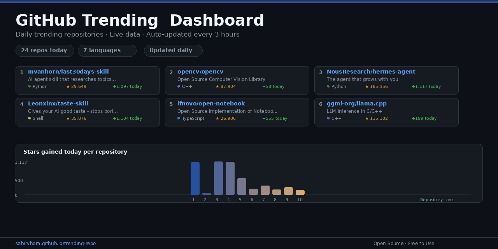

# GitHub Trending Dashboard

Daily trending repositories from GitHub, auto-updated every 3 hours. Live site: **[sahirvhora.github.io/trending-repo](https://sahirvhora.github.io/trending-repo/)**



## What It Does

- Shows GitHub's trending repos with stars, language, and descriptions in a sortable, searchable table
- Auto-fetches fresh data every 3 hours via GitHub Actions - no manual uploads needed
- Chart views for language distribution and top starred repos
- CSV export, dark/light theme, pagination

## Live Site

No setup needed. The dashboard runs as a static site:

**https://sahirvhora.github.io/trending-repo/**

## How It Works

| Component | Role |
|-----------|------|
| `index.html` | Standalone dashboard (works in any browser, zero deps) |
| `.github/workflows/update-trending.yml` | Runs every 3h: scrapes GitHub trending, bakes data into index.html, saves JSON snapshot |
| `fetch_trending.py` | Scraper for GitHub trending repos (also supports `--save`, `--compare`, `--trend` for local use) |
| `data/` | Archived JSON snapshots per fetch |
| `preview.png` | OG social card |

## Local CLI

```bash
# Fetch and print trending repos
python fetch_trending.py

# Filter by language
python fetch_trending.py --lang python

# Weekly trending
python fetch_trending.py --since weekly

# Compare two snapshots
python fetch_trending.py --compare data/trending_old.json data/trending_new.json
```

## Project Structure

```
.
├── index.html                 # Dashboard (auto-updated by CI)
├── fetch_trending.py          # GitHub trending scraper
├── favicon.svg                # Browser icon
├── preview.png                # OG social card
├── .github/workflows/         # CI: fetch + deploy every 3h
├── data/                      # Historical JSON snapshots
└── scripts/update_index_html.py  # CI entry point
```

## Tech

Pure HTML/CSS/JS frontend. Chart.js for charts. Python scraper. GitHub Actions for scheduling and deploy.

MIT License. Built by [Sahir Vhora](https://github.com/SahirVhora).
